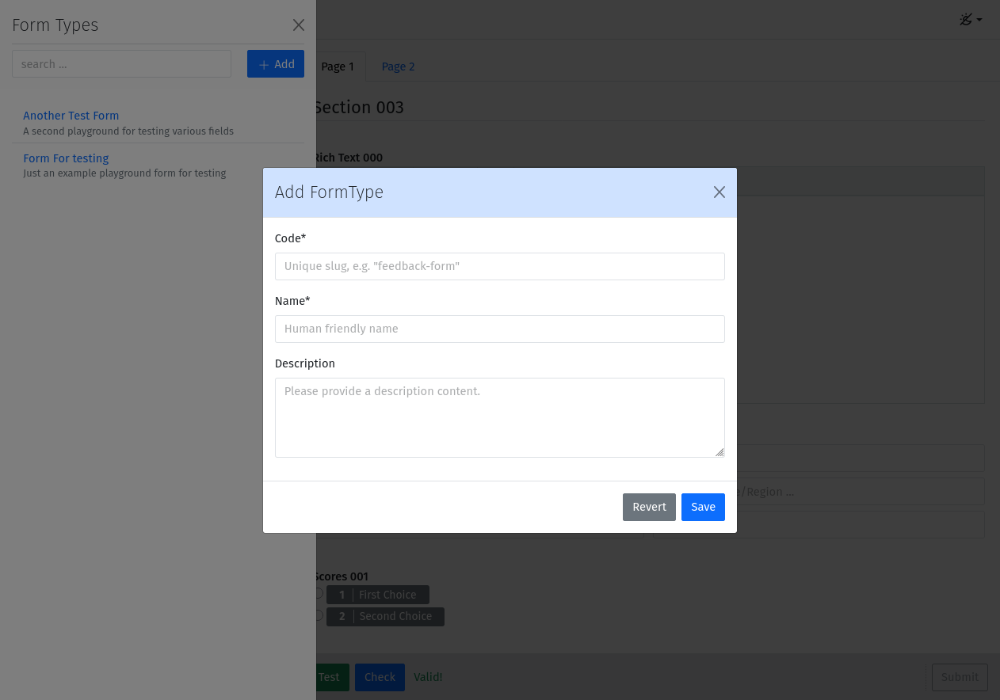
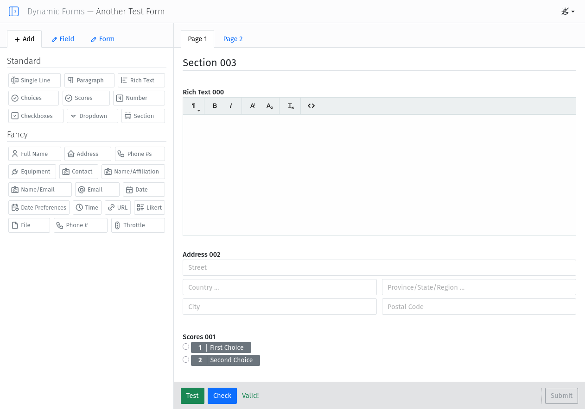

# Django Dynamic Forms
A Django reusable App for dynamically designing and generating forms.

### Features
- Visual form builder interface
- Dynamic field addition and configuration
- Drag-and-drop field creation/arrangement
- Support for complex field types with sub-fields
- Multi-Page forms
- Live form preview
- Works with Bootstrap 5
- Support for light/dark themes
- Additional field types created in other django apps, are auto-detected and can be used in the form builder
- Supports custom validation and error handling
- Ability to associate rules with fields, allowing for conditional logic to hide or show fields based on user input on other fields

### Installation
1. Install the package using pip:
   ```bash
   pip install django-dynamic-forms
   ```
   
2. Add `dynamic_forms` and it's requirements to your `INSTALLED_APPS` in `settings.py`:
   ```python
    INSTALLED_APPS = [
         ...
         'crispy_forms',        # for form rendering
         'crispy_bootstrap5',   # for Bootstrap 5 support 
         'crisp_modals',        # for modal dialogs
         'dynamic_forms',
         ...
    ]
    ```

3. Include the app URLs in your project’s `urls.py`:

   ```python
   from django.urls import path, include

   urlpatterns = [
       ...
       path('dynforms/', include('dynforms.urls')),
       ...
   ]
   ```

4. Create the necessary database tables by running the migrations:

   ```bash
   python manage.py migrate
   ```

## Usage

- Access the form builder at `/dynforms/`.
- Create a new form by clicking "Add Form" icon on the off-canvas Form Types sidebar or select a form from the list to edit it.
- The search bar allows you to filter the form list.
- Use the sidebar to add fields or drag a field from the sidebar onto the form to add it.
- To edit for field click on it and edit the settings using the form on the left-sidebar. Many of the field parameters
  will auto-apply and update the form in real-time.
- Undo/Redo capabilities are not yet implemented. All changes are currently saved automatically as you edit the form.
- To delete a field, click the trash icon on the field settings form.
- Fields can be rearranged by dragging them within the form.

## Abstract Model Classes

Inherit from the abstract class `BaseForm`, to create a model which records data from a dynamic form. This class provides 
the necessary fields and methods to handle form data. The `BaseForm` class provides the following fields:

- `created`: DateTime field that records when the form was created.
- `modified`: DateTime field that records when the form was last modified.
- `form_type`: A Foreign key to the form.
- `details`: A JSON field that stores the form data submitted by the user.
- `is_complete`: A Boolean field that indicates whether the form data is complete. Partial submissions are allowed to be saved, and the form can be completed later.

Additionally, the `BaseForm` class provides the following methods:

- `get_field_value(self, field_name, default=None)`: Returns the value of a specific field in the form.
- `validate(self, data=None)`: Sets the value of a specific field in the form. The validation login uses either the provided data or the current saved form data.


## Screenshots


*Field settings sidebar*


*Form Creation*


*List of forms*


*Form Builder interface showing the field menu and main designer area*


*Form editor showing multi-page form support*

## Contributing

Pull requests and issues are welcome!

## License

[MIT License](LICENSE)

---

Adjust the details as needed for your specific app and distribution method.   

 